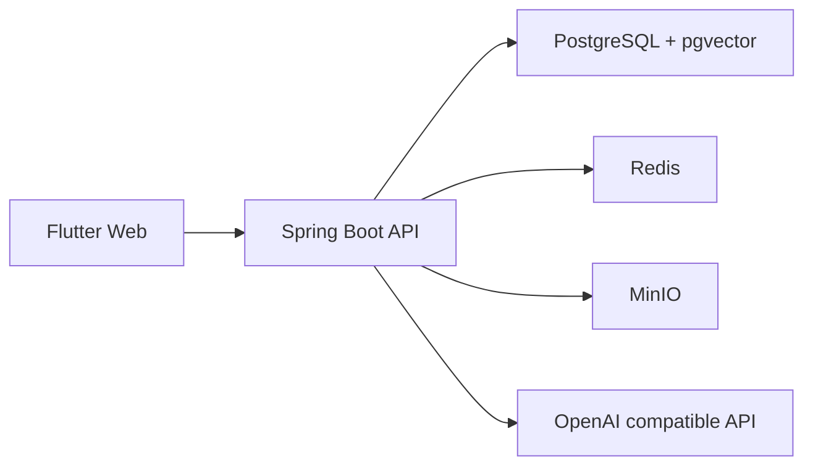

# 架构说明

## 系统边界



仓库采用 Monorepo：

- `apps/api`：后端业务、认证、持久化、AI 和管理接口。
- `apps/web_flutter`：公开页面、用户中心和管理中心。
- `infra`：本地开发基础设施（PostgreSQL、Redis、MinIO）。
- `deploy`：生产部署包（Dockerfile、Nginx 配置、docker-compose）。
- `scripts`：开发和诊断入口。
- `docs`：当前说明与归档资料。

## 后端结构

业务模块优先采用以下目录：

```text
<module>/
  application/
    dto/
    service/
  domain/
    model/
    repository/
  infrastructure/
    web/
```

依赖方向为 `infrastructure -> application -> domain`。`config` 保存框架配置，`shared` 保存跨模块的响应、异常、事件和通用基础设施。

服务命名：

- 公开只读服务：`*QueryService`
- 写操作服务：`*CommandService`
- 管理端服务：`*AdminService`
- 异步审核或专用流程：使用明确职责名，如 `CommentAuditService`
- HTTP 控制器：`*Controller`
- 出参 DTO：`*Response`；入参 DTO：`*Request`

## 前端结构

```text
lib/src/
  core/       API、模型、SSE 与通用基础能力
  auth/       会话与 OAuth 状态
  state/      跨页面 Riverpod 状态
  features/   按页面或业务功能组织
  router/     路由和应用壳
  theme/      设计令牌与主题
  widgets/    跨功能复用组件
```

命名约定：

- 页面：`*_page.dart`
- 管理标签页：`*_admin_tab.dart`
- 对话框：`*_dialog.dart`
- Provider：`*Provider`
- 状态控制器：`*Controller` 或 `*Notifier`
- API mixin：单数业务域 + `Api`，例如 `FriendApi`
- 请求方法使用动词开头，例如 `fetchProfile`、`updateProfile`

功能私有组件应放在对应 `features/<feature>/widgets`；只有跨功能复用时才进入根级 `widgets`。

## 当前结构债务

按风险和收益排序：

1. 拆分超过 700 行的 Flutter 页面，优先处理 `content_admin_tab.dart`、内容详情和内容列表。
2. 将 `core/api/admin_api.dart` 按内容、互动、用户、AI 管理域拆分，保留统一 `BlogApiClient` 组合入口。
3. 将大型页面中的数据加载和写操作继续下沉到 Controller/Notifier，页面只负责组合与交互。
4. 对高风险后端流程按需补集成测试；常规发布以脚本检查和人工冒烟为主。

这些调整应分批提交，避免与业务修复混在同一变更中。

## 变更规则

- API 路径或 DTO 字段变化时，同步更新 OpenAPI、Flutter 模型和契约测试。
- 当前数据库迁移以 `V1` 最终结构和 `V2` 初始数据为基线；后续结构变化再新增 migration。
- 新模块优先遵循现有业务分层，不在根包新增控制器或 DTO。
- 归档资料不再承载当前状态；当前能力写入 `features.md`，运行和部署变化写入 `runbook.md`、`deployment.md`。
