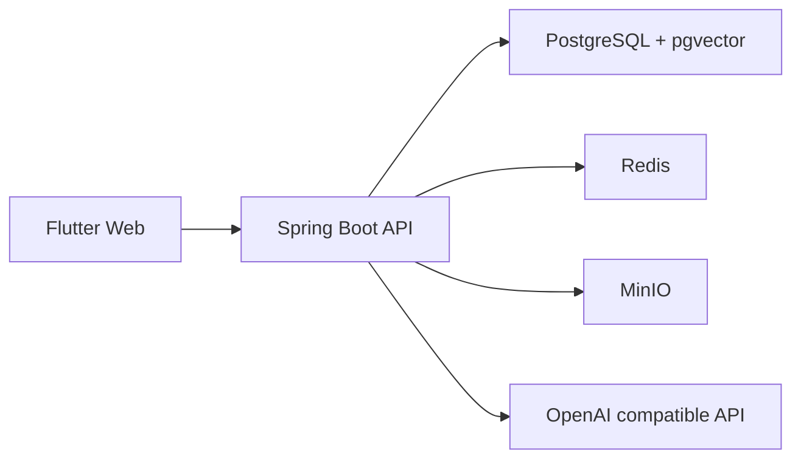

# 架构说明

## 系统边界



仓库采用 Monorepo：

- `apps/api`：后端业务、认证、持久化、AI 和管理接口。
- `apps/web_flutter`：公开页面、用户中心和管理中心。
- `infra`：本地开发基础设施（PostgreSQL、Redis、MinIO）。
- `deploy`：生产部署包（Caddy 配置、docker-compose）。
- `scripts`：开发和诊断入口。
- `docs`：当前说明与归档资料。

## 后端结构

业务模块优先采用以下目录：

```text
<module>/
  application/
    dto/
    event/
    port/
    service/
  domain/
    model/
    repository/
  infrastructure/
    storage/
    web/
```

依赖方向为 `infrastructure -> application -> domain`。应用层通过 `port` 声明外部能力，基础设施适配器实现端口。`config` 保存框架配置，`shared` 只保存跨模块的技术原语、响应和异常。业务事件位于发布模块的 `event` 包。

事件监听器归消费模块所有：缓存刷新属于 `content`，评论审核属于 `interaction`，AI 消息审核属于 `ai`。禁止在 `shared` 中集中编排业务模块。

服务命名：

- 公开只读服务：`*QueryService`
- 写操作服务：`*CommandService`
- 管理端服务：`*AdminService`
- 异步审核或专用流程：使用明确职责名，如 `CommentAuditService`
- HTTP 控制器：`*Controller`
- 出参 DTO：`*Response`；入参 DTO：`*Request`

## 前端结构

```text
lib/src/
  core/       API、模型、SSE 与通用基础能力
  auth/       会话与 OAuth 状态
  state/      尚未迁移的跨页面 Riverpod 状态
  features/   按页面或业务功能组织
  router/     路由和应用壳
  theme/      设计令牌与主题
  widgets/    跨功能复用组件
```

新增或重构的复杂 feature 采用轻量垂直切片：

```text
features/<feature>/
  data/          API、DTO 映射和可选 Repository
  application/   Riverpod Controller/Notifier 与流程状态
  presentation/  页面和 feature 私有组件
```

不要为简单只读接口机械创建 Repository 或 UseCase；只有涉及缓存、多数据源、复杂流程或需要测试替身时再增加抽象。

命名约定：

- 页面：`*_page.dart`
- 管理标签页：`*_admin_tab.dart`
- 对话框：`*_dialog.dart`
- Provider：`*Provider`
- 状态控制器：`*Controller` 或 `*Notifier`
- API mixin：单数业务域 + `Api`，例如 `FriendApi`
- 请求方法使用动词开头，例如 `fetchProfile`、`updateProfile`

功能私有组件应放在对应 `features/<feature>/widgets`；只有跨功能复用时才进入根级 `widgets`。

## 当前结构债务

按风险和收益排序：

1. 继续将其他大型页面中的数据加载和写操作下沉到 feature 内 Controller/Notifier；主页、认证页和个人资料页已完成入口/presentation 分离。
2. 消除 `content ↔ interaction` 的模块级环后，再试点 test-scope Spring Modulith 验证。
3. 对高风险后端流程继续补模块集成测试；常规发布执行脚本检查和人工冒烟。

这些调整应分批提交，避免与业务修复混在同一变更中。

## 变更规则

- API 路径或 DTO 字段变化时，同步更新 OpenAPI、Flutter 模型和契约测试。
- 当前数据库迁移以 `V1` 最终结构和 `V2` 初始数据为基线；后续结构变化再新增 migration。
- 新模块优先遵循现有业务分层，不在根包新增控制器或 DTO。
- `ArchitectureBoundaryTest` 必须通过；不得通过白名单隐藏新增的反向依赖。
- 应用服务不得直接依赖 `infrastructure`，需要外部能力时在所属模块的 `application/port` 声明端口。
- 事件监听器放在消费模块的 `application/event`，不要重新建立全局监听器。
- `user` 不得依赖 `auth` 内部类型；OAuth 账户能力通过 `user/application/port/OAuthAccountPort` 访问，由 `auth/infrastructure` 实现。
- `auth` 不得访问 `UserRepository`；注册、查找和管理员初始化通过 `user/application/api/UserAccountService` 完成。
- `auth` 只使用 `IdentityUser` 不可变快照，不得依赖 `user/domain/model` 中的 JPA Entity。
- auth 领域实体只保存 `userId`，不得建立指向用户模块 JPA Entity 的对象关联。
- interaction 领域实体只保存 `contentId` 和 `userId`；内容校验、计数和批量摘要通过 `content/application/api`，用户展示信息通过 `user/application/api` 获取。
- AI chat 会话与每日配额只保存 `userId`；身份校验、批量展示和管理端用户关键词匹配通过 `user/application/api` 完成。
- audit 日志只保存可空的 `actorUserId`，用户删除后保留审计历史；展示信息通过用户模块批量快照补齐。
- content 不直接调用 AI 索引服务；发布、归档、删除和恢复通过内容生命周期事件驱动 AI 消费者。AI knowledge 只通过 `content/application/api` 读取可索引内容快照。
- admin dashboard 只组合各模块的 overview API；content、AI tools、auth、friend 和 user Web 访问外部能力时只使用对应模块的 `application/api`。
- `UserProfileResponse` 等跨模块响应契约归入 `application/api`；模块内部 DTO 不作为外部依赖入口。
- 归档资料不再承载当前状态；当前能力写入 `features.md`，运行和部署变化写入 `runbook.md`、`deployment.md`。
